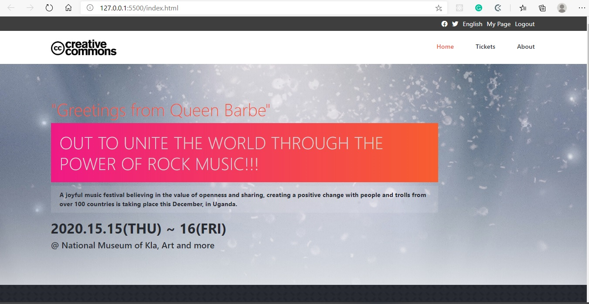

# HTML Capstone Project

The is an HTML & CSS Capstone Project based on an online website for a fictional musical concert. It's a real-world-like project, built with business specifications and needs.

You can find the original project specifications [here](https://www.behance.net/gallery/29845175/CC-Global-Summit-2015)

# Screenshot

# Built with

- Html5
- CSS3
- Bootstrap v4

# Live Demo

[Live demo](https://rawcdn.githack.com/asiimwedismas/html-capstone-project/90749215c356ec06d74922b03a2702a0274c6585/index.html)

# Authors

Dismas Asiimwe

- Github: [@asiimwedismas](https://github.com/asiimwedismas)
- Linkedin: [@asiimwedismas](https://www.linkedin.com/in/asiimwedismas/)
- Twitter: [@asiimwedismas](https://www.twitter.com/asiimwedismas)

# License

[Creative Commons license of the design](https://creativecommons.org/licenses/by-nc/4.0/)
